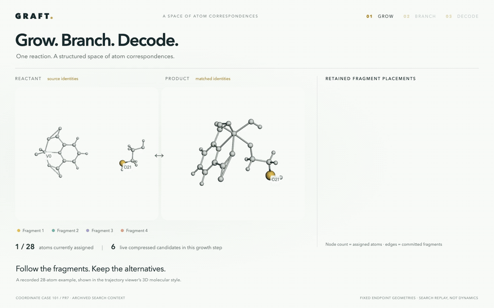
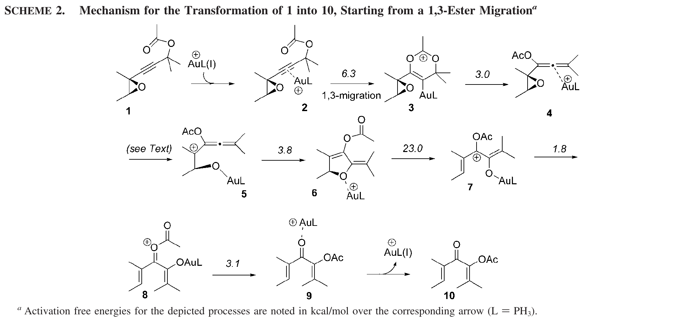
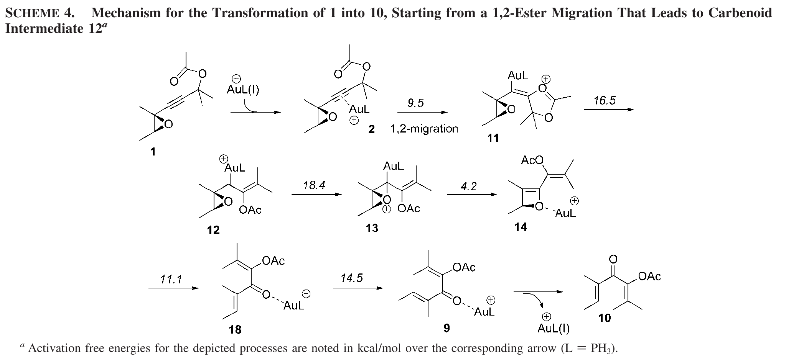
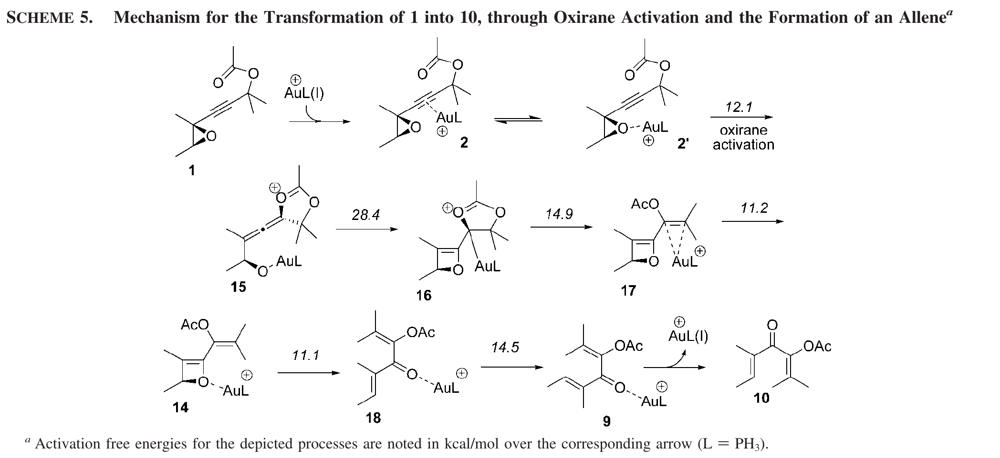
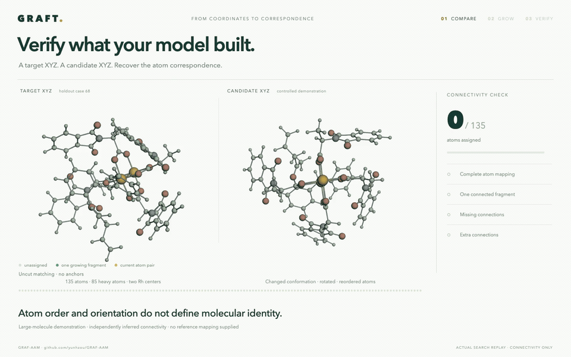
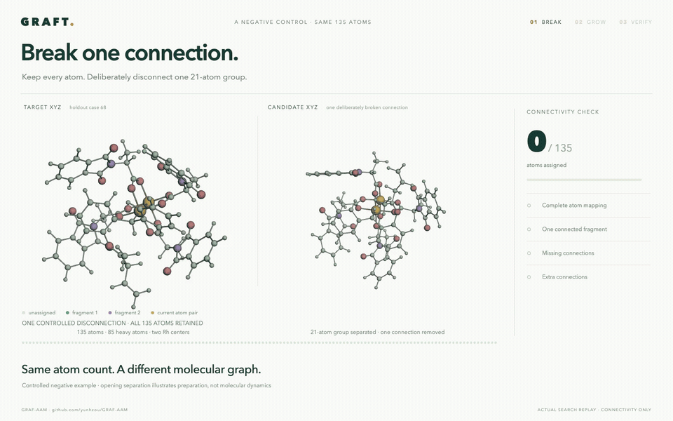
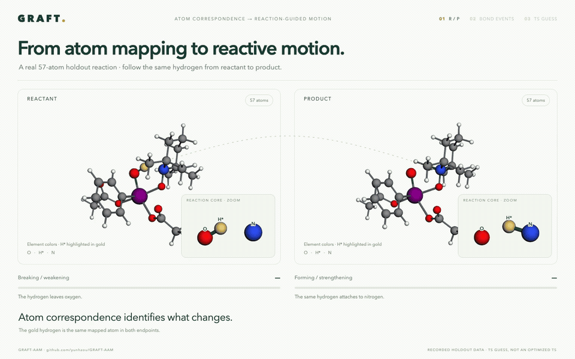

# GRAFT (`graft`)

The default GRAFT pipeline uses one seed ordering per cut, the uncut plus single-edge sweep, and branch cap 100. Match with `search_aam`, then decode bond-event alternatives separately. See the [Python API example](docs/PYTHON_API.md). Fragment competition is an experimental, explicit opt-in extension and is off by default; it is not part of the published method.

Symmetry-aware WBO atom mapping, analytical R/P alignment, and
mechanism-local transition-state analysis.

Paper benchmarks: [results and artifact index](reports/README.md) ·
[benchmark scripts and reproduction guide](bench/README.md).
[Final end-to-end timing](reports/final_end_to_end_20260916/README.md) records search plus bond-event decoding, including watchdog interruptions.

Interactive views use [two shared styles](docs/VIEWERS.md): the original white
R/P/TS presentation and the catalog/results presentation.

## Grow, branch, decode



A 22-second Golden example: fragments grow into conditional branches, and the two grown branches decode to two distinct event classes on the right. Two decoded event classes are illustrated, including the reference-equivalent class; the saved catalogue contains nine. Red × marks show breaking or weakening; green inward arrows show forming or strengthening.

[Full-resolution MP4](manuscript/animations/graft_research_preview/graft-grow-branch-decode.mp4) · [Offline interactive viewer](manuscript/animations/graft_research_preview/index.html) · [Example and provenance](manuscript/animations/graft_research_preview/README.md)

## Gold-catalyzed rearrangement · 65 atoms


Actual atom-by-atom growth through one recorded search tree in the 65-atom gold example. The two oxygen alternatives share the same 63-atom prefix; the other subtree is shown as “… 2 other terminals.” Two endpoint mappings assign O* to different product sites: the ester link or the ketone. Both patterns were recovered by the default GRAFT search and are consistent with different pathways considered in the published study. Routes b and c share one endpoint pattern; recovering a mapping does not establish the intervening mechanism.

[3D film](manuscript/animations/gold_rearrangement/gold-oxygen-3d.mp4) · [Film viewer](manuscript/animations/gold_rearrangement/index.html) · [Full growth trajectory](manuscript/animations/gold_rearrangement/trajectory.html) · [Reproduce and inspect the witnesses](examples/gold_rearrangement/README.md)


### Published pathway reference

Original **Scheme 2 (route a)** from [González Pérez et al., *J. Org. Chem.* 2009, DOI: 10.1021/jo802516k](https://pubs.acs.org/doi/10.1021/jo802516k). It is consistent with **Candidate 1** in the animation: the original epoxide oxygen becomes the ester-link oxygen.



<details>
<summary>Show the alternative published pathways: routes b and c</summary>

**Scheme 4 — route b, initial 1,2-ester migration.**



**Scheme 5 — route c, initial oxirane activation.**



Both routes match **Candidate 2**: the original epoxide oxygen becomes the ketone oxygen. They converge at intermediate 14 and share the same endpoint oxygen pattern.

</details>

These original schemes use PH₃; the animation uses the supplied AuPPh₃ endpoint structures. The displayed energies belong to the source paper. [All three pathway pictures, interpretation and attribution](manuscript/animations/gold_rearrangement/pathway-reference/README.md).

## Verify a generated structure · 135 atoms



Given a target XYZ and a candidate XYZ, recover a complete atom correspondence and check whether all inferred connections agree. This controlled demonstration uses a large holdout molecule with changed conformation and shuffled atom order. The film follows the actual one-fragment growth: **135 atoms, 148 inferred connections, no missing or extra connections**. Connectivity is inferred independently from each XYZ; bond orders, stereochemistry and stability require separate checks.

[3D video](manuscript/animations/molecule_verification/molecule-verification.mp4) · [Interactive film](manuscript/animations/molecule_verification/index.html) · [Try it with your XYZ files](examples/molecule_verification/README.md)

### Negative control · one broken connection



Keep all 135 atoms, but disconnect one 21-atom group. The recorded search still maps every atom, now in **two fragments (114 + 21)**. The final check finds **one missing connection** and rejects the candidate. The animation shows the deliberate separation, the actual interrupted growth, and the failed verdict.

[Broken-molecule video and evidence](manuscript/animations/molecule_verification_broken/README.md) · [Run the negative control](examples/molecule_verification/README.md#negative-control-break-one-connection)

## From R/P mapping to a guided TS mode



A 57-atom holdout example: map the endpoints, identify O–H weakening and N–H strengthening, then use the existing TS workflow to select a recorded imaginary mode at the guess. A reaction-core close-up shows the transferring hydrogen. A stable mode is shown for contrast; this guess has one imaginary mode. The geometry is a **TS guess, not an optimized TS**.

[3D video and scoring evidence](manuscript/animations/ts_mode_selection/README.md) · [Interactive film](manuscript/animations/ts_mode_selection/index.html) · [Self-contained Python replay](examples/ts_mode_selection/README.md)

## Current work and stable versions

See the [branch guide](docs/BRANCHES.md) for preserved pre-acceleration baselines,
active development, and archived experiments. The
[manuscript folder](manuscript) on `main`
contains the manuscript PDF, figures, animations, and reproducible figure data.

## Design

The main Python workflow keeps search and event decoding separate:

```text
search_aam -> AAMResult -> decode_events -> DecodedEvents
                                          |- unique event candidates
                                          |- witness mappings
                                          `- symmetry and shuffle queries
```

The optional geometry/TS workflow consumes the same AAM result:
`group_mechanisms` → `compile_mechanism_families` → `select_rp_mappings`
→ `analyze_transition_state`.

AAM is the authoritative source of mapping information. Its result retains
a fragment-decision graph with shared prefixes/reconvergence, compressed
placements, exact target generators, seed/cut provenance, and cap records.
Mechanisms are an optional post-processing result, not the core container.
`match_fragment` is independently reusable by AAM and retro detection.
R/P and TS processing consume those objects;
they do not reconstruct an alternative AAM model from serialized records.

See [the search-graph API](docs/AAM_SEARCH_GRAPH_API.md) for the object model,
conditional fragment API, persistence, and path replay;
[ALGORITHM.md](ALGORITHM.md) covers downstream algorithms.
See [retro detection and assembly](docs/RETRO_ASSEMBLY.md) for geometric
building-block recommendation using the same matcher and saved AAM graphs.
The separate [big-block / gap-first beta](docs/RETRO_BETA.md) defers augmentation
until a reactant is selected; it does not replace the full workflow.

## Install

```bash
python -m pip install -e ".[postprocessing]"
```

Installation builds the native bookkeeping extensions and requires a C++17
compiler; build isolation installs pybind11. Python still owns the AAM search
graph, fragment hierarchy and retro pipeline. The `_group_ops` extension
accelerates exact permutation/occupation operations, not search-policy changes.

Install xTB separately only when endpoint WBO matrices must be computed. The
typed core API accepts already materialized coordinates and WBO matrices and
does not invoke xTB.

## Python API

The Python package and command are now named `graft` (formerly `rxn_core` / `rxn-core`). Reinstall from this checkout and rebuild the optional native engine after updating. Use `import graft` and `from graft.postprocessing import decode_events`. Existing saved results remain readable; versioned archive identifiers and event IDs retain their original names for compatibility. `GRAFT_NATIVE=0` selects Python growth; the former `RXN_CORE_NATIVE` setting is still accepted as a fallback.

Start with the executed, self-contained [AAM notebook](docs/AAM_SIMPLE.ipynb): embedded molecules, matching, raw branch inspection, unique bond-event candidates, certified symmetry queries, py3Dmol inspection, and a growth animation for each sweep. All inputs and display helpers are in the notebook; no benchmark files are needed. The [Python API guide](docs/PYTHON_API.md) lists anchors, directions, conditional matching, all configuration controls, and current chirality limitations. Install its dependencies with `python -m pip install -e ".[notebook]"`.

```python
from graft import AAMProblem, MolecularEndpoint, AAMSearchConfig, search_aam
from graft.postprocessing import EventDecodeConfig, decode_events

# Arrays for both endpoints are embedded in docs/AAM_SIMPLE.ipynb.
problem = AAMProblem(
    MolecularEndpoint(elements_R, xyz_R, wbo_R, label="R"),
    MolecularEndpoint(elements_P, xyz_P, wbo_P, label="P"),
    name="reaction",
)
aam = search_aam(
    problem,
    AAMSearchConfig(iso_tolerance=1.0, seed_count=1,
                    sweep_cuts=True, branch_limit=100),
    workers=1,
)
decoded = decode_events(
    aam, EventDecodeConfig(threshold=0.5, metal_threshold=0.3),
)
print("Search capped:", aam.graph.capped)
print("Saved-family decoding complete:", decoded.complete)
for candidate in decoded.candidates:
    print(candidate.total, candidate.events, candidate.mapping)

if decoded.candidates:
    candidate = decoded.candidates[0]
    symmetry = decoded.symmetry(candidate)
    # Edit this condition to ask whether a proposed assignment is allowed.
    answer = decoded.query(candidate, {0: candidate.mapping[0]}, same_events=True)
    print(answer.status)  # allowed, forbidden, or unknown within saved families
```

A candidate is one signed bond-event class with a witness mapping and supporting
family IDs. `decoded.complete` certifies decoding of retained complete families
in the requested window; it does not certify exhaustive AAM search. The decoder
retains all represented event counts by default, including nonminimum
alternatives. Search and final event tolerances are configured independently.

Anchors use `AAMSearchConfig(anchors=((r_atom, p_atom),))`.
`from graft import search_aam_directions` exposes forward, reverse,
smaller-first, larger-first, and both-direction searches. The
[API guide](docs/PYTHON_API.md) documents conditional fragment matching,
fixed-query isomorphism, serialization, and the current chirality TODO.

For one animation per sweep, use the in-memory result directly:

```python
from pathlib import Path
from graft.viewers import aam_growth_html

Path("aam_growth.html").write_text(aam_growth_html(aam), encoding="utf-8")
```

The offline viewer replays recorded fragment calls and verifies their outputs;
it does not enumerate every symmetry permutation. The notebook embeds it in an
iframe alongside py3Dmol views. GitHub shows saved text and molecule PNGs;
interactive views require a trusted Jupyter notebook.

`align_reaction`, `group_mechanisms`, `compile_mechanism_families`,
`select_rp_mappings`, and `analyze_transition_state` remain importable from
`graft` for the optional geometry/TS workflow, illustrated in
[TUTORIAL.ipynb](docs/TUTORIAL.ipynb).

## CLI

NPZ endpoint files contain `elements`, `coordinates`, and `wbo` arrays:

```bash
graft \
  --stage rp \
  --reactant-npz R.npz \
  --product-npz P.npz \
  --workers 48 \
  --post-workers 8 \
  --output alignment
```

Existing xTB cache directories containing one XYZ and a `wbo` file can be
used directly:

```bash
graft --reactant-cache cache/R --product-cache cache/P \
  --workers 48 --output alignment
```

The output contains `rp.json`, one `R.xyz` and `P_aligned.xyz` pair per
mechanism, a reusable `reaction.json`, and a self-contained `view.html`.
The TS verifier/scorer can then be entered independently without R/P search:

```bash
graft --stage ts \
  --reactant-npz R.npz --product-npz P.npz \
  --reaction-json alignment/reaction.json \
  --target-npz guess_1.npz --target-npz guess_2.npz \
  --output ts_scores
```

Use `--stage full` to compose both stages in one process. Target NPZ files
contain `elements`, `coordinates`, `wbo`, `frequencies`, and `modes`.

The executed [tutorial notebook](docs/TUTORIAL.ipynb) demonstrates the staged
Python API, CPU controls, AAM inspection, R/P alignment, and TS scoring.

## Result hierarchy

```text
AAMResult
`- AAMSearchGraph
   |- contexts, states, transitions, and stop/cap evidence
   `- compressed placements, conditioned generators, and provenance

DecodedEvents                              # separate signed-event post-processing
`- EventCandidate[]                        # one witness per unique event class
   |- event edges, count, and supporting family IDs
   `- symmetry evidence and conditional shuffle queries

MechanismResult / AnalyticalAAMResult       # optional geometry/TS pipeline
`- analytical mapping families per mechanism

RPResult
`- selected mapping per mechanism, with index-chirality diagnostics

TSResult
`- R->TS and P->TS CoreAAMResult plus scored core tuples
```

## Tests

```bash
python -m pytest -q
```

The suite includes a non-empty TS integration case that performs endpoint
AAM, analytical-family compilation, R/P selection, two partial core searches,
endpoint-consensus merging, and imaginary-mode scoring.

## Repository layout

| Location | Contents |
|---|---|
| `src/graft/` | Importable matching, search, separate decoding, geometry, and viewers |
| `docs/` | Executed notebooks and public API documentation |
| `bench/` | Benchmark entry points and shared evaluators; see the [guide](bench/README.md) |
| `bench/experiments/` | Optional research experiments, excluded from the published default |
| `bench/archive/`, `bench/contracts/` | Frozen campaign source and regression contracts |
| `reports/` | Saved measurements, witnesses, provenance, and benchmark summaries |
| `manuscript/` | Current paper, figures, research preview, and reproducibility bundle |
| `tests/`, `native/`, `tools/`, `hpc/` | Tests, native implementation, user utilities, batch launch examples |

See the [cleanup record](docs/PUBLICATION_CLEANUP.md) for source relocations,
removed superseded artifacts, and recovery paths.

## Authors

Yunheng Zou; Olalla Nieto Faza; Shifa Hussain; **Varinia Bernales (PI)**;
**Alán Aspuru-Guzik (PI)**. PI means principal investigator. Full affiliations
are listed in the [manuscript](manuscript/manuscript.pdf).
