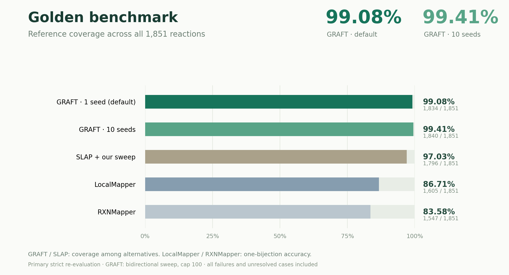

# GRAFT: fragment-based atom–atom matching

**Match atoms. Recover alternatives. Understand structural change.**

GRAFT is a Python library for atom–atom matching (AAM) between molecular structures. It grows matching fragments, branches over alternative placements, and keeps symmetry-related correspondences in a compressed representation. A separate decoder turns those families into distinct bond-change candidates, each with an explicit atom mapping and queryable symmetry information.

Use GRAFT to map reactants to products, analyze how molecular structures differ, verify generated structures against a target, or carry reaction-core correspondences into transition-state workflows. It works with molecular graphs and supplied bond-order matrices, including continuous Wiberg bond orders (WBOs).

**Golden reference coverage: 99.08% with the default one-seed sweep; 99.41% with ten seeds.** These scores measure recovery among alternatives across all 1,851 reactions.

[Try the notebook](docs/AAM_SIMPLE.ipynb) · [Python API](docs/PYTHON_API.md) · [Paper](manuscript/manuscript.pdf) · [Benchmark evidence](reports/README.md)

## Golden benchmark: coverage of mapping alternatives



**Coverage means that the annotated heavy-atom correspondence is present among the returned alternatives**, allowing equivalent endpoint symmetries. It measures reference inclusion, not whether an automatically ranked first candidate is correct. For methods returning one bijection, the same check measures that bijection's accuracy. Failures and unresolved cases remain in the denominator.

<!-- golden-coverage-table:start -->

| Method | Search setting | Output | References covered | Coverage |
|---|---|---|---:|---:|
| **GRAFT** | **1 seed, sweep (default)** | Compressed families | **1,834 / 1,851** | **99.08%** |
| GRAFT | 3 seeds, sweep | Compressed families | 1,837 / 1,851 | 99.24% |
| GRAFT | 10 seeds, sweep | Compressed families | 1,840 / 1,851 | 99.41% |
| SLAP | Bidirectional + our sweep | Multiple candidates | 1,796 / 1,851 | 97.03% |
| SLAP | Bidirectional, no sweep | Multiple candidates | 1,661 / 1,851 | 89.74% |
| SLAP | Default, no sweep (binary) | Multiple candidates | 1,591 / 1,851 | 85.95% |
| LocalMapper | Default, no sweep | One bijection | 1,605 / 1,851 | 86.71% |
| RXNMapper | Default, no sweep | One bijection | 1,547 / 1,851 | 83.58% |
| Chython | Default, no sweep | One bijection | 1,561 / 1,851 | 84.33% |
| Reaction Decoder Tool (RDT) | Default, no sweep | One bijection | 1,030 / 1,851 | 55.65% |
| Indigo | Default, no sweep | One bijection | 692 / 1,851 | 37.39% |

<!-- golden-coverage-table:end -->

GRAFT rows use bidirectional search and branch cap 100. Bidirectional combines searches starting from each endpoint. The cut sweep is part of default GRAFT; **SLAP + our sweep** applies our search extension to SLAP and is not its original published score. The bidirectional SLAP rows combine its binary and weighted modes; the released default row uses binary only. All numbers above come from our strict re-evaluation, including LocalMapper, the prior accuracy-SOTA baseline discussed in the paper.

[Full comparison and CPU timings](manuscript/manuscript.pdf) · [Coverage data and source hashes](docs/assets/golden-coverage.json) · [Comparator audit](reports/golden_competitor_recheck_20260913/README.md) · [Branch-cap ablation](reports/golden_controlled_20260915/README.md) · [Rebuild the plot/table](bench/publish_readme_coverage.py)

## What you can do with GRAFT

- **Atom–atom matching:** recover alternative reactant/product correspondences and inspect the fragments supporting each match.
- **Structure analytics:** compare bond-change patterns, locate reaction cores, and query which atom shuffles preserve a candidate's events.
- **Structure verification:** compare a generated XYZ with a target and identify missing or extra connections under a chosen connectivity rule.
- **Reaction and TS workflows:** explore correspondence-dependent pathway hypotheses, align endpoints, and score recorded modes at a TS guess.

Different atom assignments can imply different bond changes and reaction-core motions. Keeping alternatives makes those choices available for inspection and downstream calculations. Endpoint correspondence alone does not establish a reaction pathway.

## Get started

```bash
git clone git@github.com:yunhzou/GRAFT-AAM.git
cd GRAFT-AAM
python -m pip install -e ".[notebook]"
```

Open [the self-contained AAM notebook](docs/AAM_SIMPLE.ipynb) for embedded molecules, public Python imports, matching, unique candidates, symmetry queries, and py3Dmol visualization. For a smaller installation without notebook dependencies, use `python -m pip install -e ".[postprocessing]"`. Building the native extensions requires a C++17 compiler. xTB is needed separately only if you want to compute WBO inputs; matching supplied arrays does not invoke it.

The core workflow has two steps:

```python
from graft import search_aam
from graft.postprocessing import decode_events

aam = search_aam(problem)       # Compressed fragment-matching families
decoded = decode_events(aam)     # Distinct bond-event candidates

for candidate in decoded.candidates:
    print(candidate.events, candidate.mapping)
```

`problem` holds the two endpoints' elements, coordinates, and bond-order matrices; see the [complete example below](#python-api) or run the notebook. Search and decoding remain separate so you can inspect the raw families or change the event definition without rerunning matching.

## Grow, branch, decode

A reaction can admit several atom correspondences, with different bond changes or symmetry-related atom assignments. Returning one mapping hides those choices, while listing every symmetry permutation quickly becomes unwieldy. GRAFT grows matching fragments, branches when alternative placements are available, and keeps symmetry compressed. Separate decoding exposes distinct bond-change candidates for inspection.


This Golden example follows the recorded growth and branching, then shows two distinct decoded event patterns, including one equivalent to the reference. The saved catalogue contains nine patterns. Red × marks indicate breaking or weakening; green inward arrows indicate forming or strengthening.

[Full-resolution MP4](manuscript/animations/graft_research_preview/graft-grow-branch-decode.mp4) · [Offline interactive viewer](manuscript/animations/graft_research_preview/index.html) · [Example and provenance](manuscript/animations/graft_research_preview/README.md)

## Use atom matching to explore alternative reaction pathways

Suppose you know the reactants and products, but want to investigate whether the reaction could follow more than one pathway. The product structure alone may not tell you which reactant atom ends up at each site. Committing to one atom mapping can hide alternative atom origins and the different bond changes they imply.

GRAFT searches for alternative correspondences so you can turn those differences into concrete pathway hypotheses. These give you starting points for mechanistic analysis and TS calculations; establishing whether a pathway exists requires investigating the steps between the endpoints.


In this gold-catalyzed rearrangement, GRAFT recovers two possible destinations for the original epoxide oxygen: the ester link or the ketone. They are consistent with different pathways considered in the published study. The video follows the actual fragment growth that finds both oxygen assignments in the 65-atom system.

[3D film](manuscript/animations/gold_rearrangement/gold-oxygen-3d.mp4) · [Film viewer](manuscript/animations/gold_rearrangement/index.html) · [Full growth trajectory](manuscript/animations/gold_rearrangement/trajectory.html) · [Reproduce and inspect the witnesses](examples/gold_rearrangement/README.md)


<details open>
<summary>View the original published pathway schemes for the gold example</summary>

### Published pathway reference

Original **Scheme 2 (route a)** from [González Pérez et al., *J. Org. Chem.* 2009, DOI: 10.1021/jo802516k](https://pubs.acs.org/doi/10.1021/jo802516k). It is consistent with **Candidate 1** in the animation: the original epoxide oxygen becomes the ester-link oxygen.


**Scheme 4 — route b, initial 1,2-ester migration.**


**Scheme 5 — route c, initial oxirane activation.**


Both routes match **Candidate 2**: the original epoxide oxygen becomes the ketone oxygen. They converge at intermediate 14 and share the same endpoint oxygen pattern.


These original schemes use PH₃; the animation uses the supplied AuPPh₃ endpoint structures. The displayed energies belong to the source paper. [All three pathway pictures, interpretation and attribution](manuscript/animations/gold_rearrangement/pathway-reference/README.md).

</details>

## Use AAM as a molecular structure verifier

Suppose a generative model produces an XYZ structure for a target molecule. Its atoms may be reordered and its conformation may look different, so comparing coordinates directly does not tell you whether it generated the intended connectivity.

GRAFT matches the generated structure to the target and checks whether the inferred connections agree under that correspondence. A complete match with no missing or extra connections verifies the same connectivity under the chosen bond-detection rule. Bond orders, stereochemistry and stability require separate checks.


This controlled demonstration uses a 135-atom target with a changed conformation and shuffled atom order to illustrate the check. GRAFT matches it as one complete fragment and preserves all 148 inferred connections.

[3D video](manuscript/animations/molecule_verification/molecule-verification.mp4) · [Interactive film](manuscript/animations/molecule_verification/index.html) · [Try it with your XYZ files](examples/molecule_verification/README.md)

### Detect a broken structure

A generated structure can contain every expected atom and still have a disconnected group. Atom counts alone would miss that error. The same AAM check can locate the missing connection and reject the structure.


Here we deliberately disconnect a 21-atom group. GRAFT still assigns all 135 atoms, but now needs two fragments and finds one missing connection. The video shows why complete atom coverage alone is insufficient for structure verification.

[Broken-molecule video and evidence](manuscript/animations/molecule_verification_broken/README.md) · [Run the negative control](examples/molecule_verification/README.md#negative-control-break-one-connection)

## Use AAM to guide TS mode selection

Suppose you have a TS guess and a frequency calculation with many vibrational modes. You need to identify the motion relevant to your intended reaction: which mode moves atoms along the bonds that should break and form? A frequency value alone does not identify that motion.

GRAFT first maps the reactant and product to identify their bond changes, then matches the reaction core into the guess. It scores how well the mode displacements follow those changes and selects among the imaginary modes. This provides a reaction-guided choice of mode for a subsequent TS search.


The video illustrates an O–H → N–H transfer in a 57-atom guess. The selected imaginary mode moves the highlighted hydrogen along the mapped bond changes; a stable mode is shown for contrast. This particular guess has one imaginary mode. The geometry remains a **TS guess, not an optimized TS**.

[3D video and scoring evidence](manuscript/animations/ts_mode_selection/README.md) · [Interactive film](manuscript/animations/ts_mode_selection/index.html) · [Self-contained Python replay](examples/ts_mode_selection/README.md)

## Design

The main Python workflow keeps search and event decoding separate:

```text
search_aam -> AAMResult -> decode_events -> DecodedEvents
                                          |- unique event candidates
                                          |- witness mappings
                                          `- symmetry and shuffle queries
```

The optional geometry/TS workflow consumes the same AAM result:
`group_mechanisms` → `compile_mechanism_families` → `select_rp_mappings`
→ `analyze_transition_state`.

The search stores fragment choices and correlated symmetry operations without expanding every atom bijection. Decoding groups the retained alternatives by their signed bond events. You can inspect a candidate's witness, ask which shuffles are allowed, or replay the search that produced it.

Default search uses one seed ordering per cut, uncut plus single-edge sweep, and branch cap 100. The [configuration guide](docs/PYTHON_API.md) covers tolerances, anchors, search directions, and chirality limitations. Fragment competition remains experimental, optional, and off by default.

See [the search-graph API](docs/AAM_SEARCH_GRAPH_API.md) for the object model,
conditional fragment API, persistence, and path replay;
[ALGORITHM.md](ALGORITHM.md) covers downstream algorithms.
See [retro detection and assembly](docs/RETRO_ASSEMBLY.md) for geometric
building-block recommendation using the same matcher and saved AAM graphs.
The separate [big-block / gap-first beta](docs/RETRO_BETA.md) defers augmentation
until a reactant is selected; it does not replace the full workflow.

## Python API

Start with the executed, self-contained [AAM notebook](docs/AAM_SIMPLE.ipynb): embedded molecules, matching, raw branch inspection, unique bond-event candidates, certified symmetry queries, py3Dmol inspection, and a growth animation for each sweep. All inputs and display helpers are in the notebook; no benchmark files are needed. The [Python API guide](docs/PYTHON_API.md) lists anchors, directions, conditional matching, all configuration controls, and current chirality limitations. Install its dependencies with `python -m pip install -e ".[notebook]"`.

```python
from graft import AAMProblem, MolecularEndpoint, AAMSearchConfig, search_aam
from graft.postprocessing import EventDecodeConfig, decode_events

# Arrays for both endpoints are embedded in docs/AAM_SIMPLE.ipynb.
problem = AAMProblem(
    MolecularEndpoint(elements_R, xyz_R, wbo_R, label="R"),
    MolecularEndpoint(elements_P, xyz_P, wbo_P, label="P"),
    name="reaction",
)
aam = search_aam(
    problem,
    AAMSearchConfig(iso_tolerance=1.0, seed_count=1,
                    sweep_cuts=True, branch_limit=100),
    workers=1,
)
decoded = decode_events(
    aam, EventDecodeConfig(threshold=0.5, metal_threshold=0.3),
)
print("Search capped:", aam.graph.capped)
print("Saved-family decoding complete:", decoded.complete)
for candidate in decoded.candidates:
    print(candidate.total, candidate.events, candidate.mapping)

if decoded.candidates:
    candidate = decoded.candidates[0]
    symmetry = decoded.symmetry(candidate)
    # Edit this condition to ask whether a proposed assignment is allowed.
    answer = decoded.query(candidate, {0: candidate.mapping[0]}, same_events=True)
    print(answer.status)  # allowed, forbidden, or unknown within saved families
```

A candidate is one signed bond-event class with a witness mapping and supporting
family IDs. `decoded.complete` certifies decoding of retained complete families
in the requested window; it does not certify exhaustive AAM search. The decoder
retains all represented event counts by default, including nonminimum
alternatives. Search and final event tolerances are configured independently.

Anchors use `AAMSearchConfig(anchors=((r_atom, p_atom),))`.
`from graft import search_aam_directions` exposes forward, reverse,
smaller-first, larger-first, and both-direction searches. The
[API guide](docs/PYTHON_API.md) documents conditional fragment matching,
fixed-query isomorphism, serialization, and the current chirality TODO.

For one animation per sweep, use the in-memory result directly:

```python
from pathlib import Path
from graft.viewers import aam_growth_html

Path("aam_growth.html").write_text(aam_growth_html(aam), encoding="utf-8")
```

The offline viewer replays recorded fragment calls and verifies their outputs;
it does not enumerate every symmetry permutation. The notebook embeds it in an
iframe alongside py3Dmol views. GitHub shows saved text and molecule PNGs;
interactive views require a trusted Jupyter notebook.

`align_reaction`, `group_mechanisms`, `compile_mechanism_families`,
`select_rp_mappings`, and `analyze_transition_state` remain importable from
`graft` for the optional geometry/TS workflow, illustrated in
[TUTORIAL.ipynb](docs/TUTORIAL.ipynb).

## CLI

NPZ endpoint files contain `elements`, `coordinates`, and `wbo` arrays:

```bash
graft \
  --stage rp \
  --reactant-npz R.npz \
  --product-npz P.npz \
  --workers 48 \
  --post-workers 8 \
  --output alignment
```

Existing xTB cache directories containing one XYZ and a `wbo` file can be
used directly:

```bash
graft --reactant-cache cache/R --product-cache cache/P \
  --workers 48 --output alignment
```

The output contains `rp.json`, one `R.xyz` and `P_aligned.xyz` pair per
mechanism, a reusable `reaction.json`, and a self-contained `view.html`.
The TS verifier/scorer can then be entered independently without R/P search:

```bash
graft --stage ts \
  --reactant-npz R.npz --product-npz P.npz \
  --reaction-json alignment/reaction.json \
  --target-npz guess_1.npz --target-npz guess_2.npz \
  --output ts_scores
```

Use `--stage full` to compose both stages in one process. Target NPZ files
contain `elements`, `coordinates`, `wbo`, `frequencies`, and `modes`.

The executed [tutorial notebook](docs/TUTORIAL.ipynb) demonstrates the staged
Python API, CPU controls, AAM inspection, R/P alignment, and TS scoring.

## Result hierarchy

```text
AAMResult
`- AAMSearchGraph
   |- contexts, states, transitions, and stop/cap evidence
   `- compressed placements, conditioned generators, and provenance

DecodedEvents                              # separate signed-event post-processing
`- EventCandidate[]                        # one witness per unique event class
   |- event edges, count, and supporting family IDs
   `- symmetry evidence and conditional shuffle queries

MechanismResult / AnalyticalAAMResult       # optional geometry/TS pipeline
`- analytical mapping families per mechanism

RPResult
`- selected mapping per mechanism, with index-chirality diagnostics

TSResult
`- R->TS and P->TS CoreAAMResult plus scored core tuples
```

## Tests

```bash
python -m pytest -q
```

The suite includes a non-empty TS integration case that performs endpoint
AAM, analytical-family compilation, R/P selection, two partial core searches,
endpoint-consensus merging, and imaginary-mode scoring.

## Repository layout

| Location | Contents |
|---|---|
| `src/graft/` | Importable matching, search, separate decoding, geometry, and viewers |
| `docs/` | Executed notebooks and public API documentation |
| `bench/` | Benchmark entry points and shared evaluators; see the [guide](bench/README.md) |
| `bench/experiments/` | Optional research experiments, excluded from the published default |
| `bench/archive/`, `bench/contracts/` | Frozen campaign source and regression contracts |
| `reports/` | Saved measurements, witnesses, provenance, and benchmark summaries |
| `manuscript/` | Current paper, figures, research preview, and reproducibility bundle |
| `tests/`, `native/`, `tools/`, `hpc/` | Tests, native implementation, user utilities, batch launch examples |

See the [cleanup record](docs/PUBLICATION_CLEANUP.md) for source relocations,
removed superseded artifacts, and recovery paths.

## Current work and stable versions

See the [branch guide](docs/BRANCHES.md) for preserved pre-acceleration baselines,
active development, and archived experiments. The
[manuscript folder](manuscript) on `main`
contains the manuscript PDF, figures, animations, and reproducible figure data.

## Compatibility

<details>
<summary>Upgrading from the former rxn_core package</summary>

The Python package and command are now named `graft` (formerly `rxn_core` / `rxn-core`). Reinstall from this checkout and rebuild the optional native engine after updating. Use `import graft` and `from graft.postprocessing import decode_events`. Existing saved results remain readable; versioned archive identifiers and event IDs retain their original names for compatibility. `GRAFT_NATIVE=0` selects Python growth; the former `RXN_CORE_NATIVE` setting is still accepted as a fallback.

</details>

## Authors

Yunheng Zou; Olalla Nieto Faza; Shifa Hussain; **Varinia Bernales†**;
**Alán Aspuru-Guzik†**. † Principal investigators. Full affiliations
are listed in the [manuscript](manuscript/manuscript.pdf).
