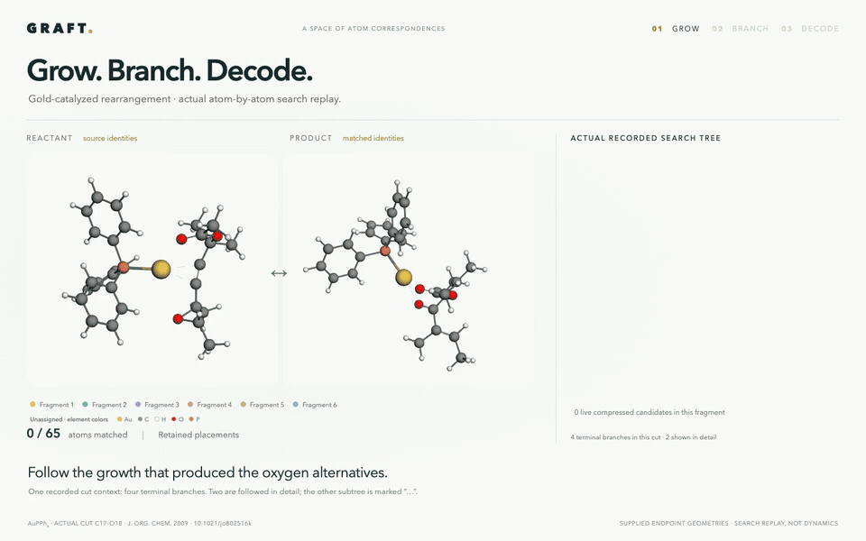

# Gold rearrangement — actual atom-by-atom growth

A **30-second 3D replay** of one recorded cut context. The matching grows atom by atom, branches from its actual shared states, and reaches the two featured oxygen alternatives. The other subtree is shown as **“… 2 other terminals”**; it has not been removed from the underlying trace.



[Film (MP4)](gold-oxygen-3d.mp4) · [Film viewer](index.html) · [Inspect every growth event and all four branches](trajectory.html) · [Inputs and reproduction](../../../examples/gold_rearrangement/README.md)

Both HTML viewers are self-contained and work offline after downloading. The detailed trajectory viewer exposes every live candidate, tested extension, deferred boundary, symmetry block and terminal branch from this cut.

## What the tree contains

The illustrated cut is **C17–O18**, using one-based indices from the original XYZ. It is archive context 21: **15 saved states, 14 fragment transitions and four complete terminal branches**. The cut is a search constraint, not an assertion that this bond breaks in the reaction.

The two featured paths share four fragment placements, reaching **63 assigned atoms**. Their next fragment is the epoxide oxygen. Two retained placements produce two 64-atom states, each completed by the remaining oxygen. The alternate earlier subtree contains the other two terminal branches and is collapsed visually to an ellipsis. Thus the film's two highlighted outputs are genuine siblings in one recorded search tree, not independent trajectories drawn as if they shared a prefix.

Growth uses captured live candidate representatives from a verified replay of the saved fragment calls. Each featured path contains **59 single-atom extensions and six seed placements**, together covering all 65 atoms. The replay also preserves ten deferred-edge decisions. All 88 retained film-frame records per path are checked against the detailed trace. The growing candidate count can rise and fall; these live candidates are not the same quantity as the four final terminal branches.

## Timeline

- **0–14 s:** actual atom additions in the four shared fragments, including the AuPPh₃ ligand. Compressed candidate counts and boundary deferrals are shown.
- **14–17 s:** the real oxygen-placement split; follow one placement and then replay the other from the same parent.
- **17–19 s:** one-second blue/purple highlights track the original epoxide oxygen, **O***, with the camera paused.
- **19–30 s:** decode the featured families and compare their product correspondences; the other two families remain indicated by the ellipsis.

The final cards enlarge the organic core. Fragment colors show correspondence. Red crosses and green inward arrows annotate changes involving O*; black lines retain existing bonds. The badges count all signed threshold events in each full witness, including bond-order and metal changes. They are not counts of elementary reaction steps.

## Pathway interpretation

Candidate 1 sends O* to the product's **ester-link oxygen**, consistent with literature route a. Candidate 2 sends O* to the **ketone oxygen**, consistent with routes b and c. Those two literature routes converge at intermediate 14 and share an endpoint oxygen pattern. The paper favors route a energetically. GRAFT recovered the correspondences from endpoints alone; it did not calculate the intermediate mechanisms or their kinetics.

Source: González Pérez et al., *J. Org. Chem.* **2009**, 74, 2982–2991. [DOI: 10.1021/jo802516k](https://pubs.acs.org/doi/10.1021/jo802516k). The input preparation and independent oxygen-provenance interpretation are documented in the linked example.

The endpoint coordinates are rigidly aligned for display. The film is a search replay, not molecular dynamics. Core close-ups omit catalyst atoms only from the drawing. Dashed gold contacts use a display WBO range of 0.15–0.45, separate from matching and event thresholds. Other sweep contexts are outside this film's scope. The full family union is not exhaustively decoded here.

## Rebuild or inspect

```bash
python manuscript/scripts/gold_film/build.py
node manuscript/scripts/gold_film/render.cjs manuscript/animations/gold_rearrangement 3d --video
python manuscript/scripts/gold_film/export_gif.py manuscript/animations/gold_rearrangement
```

The builder verifies every featured growth frame against `trajectory.json.gz`, checks shared-prefix transitions and the collapsed subtree, and certifies both complete witnesses against their compressed families. The browser renderer checks the real tree, one-second highlights, paused camera and mapping injectivity. The MP4 is 1440 × 900 at 24 fps; the GIF is 960 × 600 at 12 fps.

To regenerate an inspectable trace from the example's checkpoint:

```bash
python examples/gold_rearrangement/run_gold.py --output gold-output
python manuscript/scripts/gold_film/capture_trajectory.py \
  gold-output/aam.checkpoint gold-trace --context 21
```

The replay has a 300-second watchdog and checks its fragment results against the saved archive. The standalone detailed viewer keeps all four branches available; the promotional film collapses only the explicitly counted subtree.
