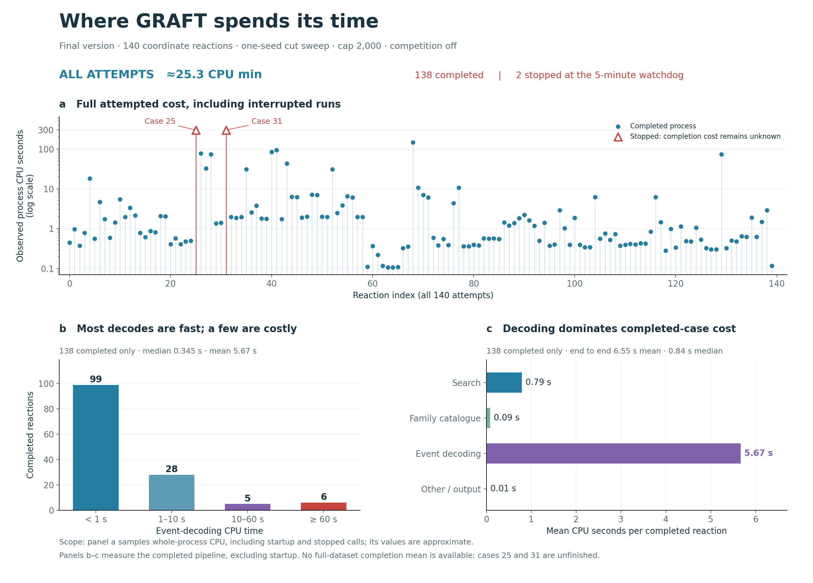

# Final GRAFT end-to-end timing

Fresh attempts: 140/140; completed within the five-minute watchdog: 138.

One seed, single-edge cut sweep, cap 2,000, R-to-P, competition off. Event windows match the published 140-case comparison. No candidate-count cap. Four processes, each using one numerical thread.

## All attempted work, including timeouts

Observed process CPU spent across all 140 attempts was approximately **25.33 CPU minutes**, or **10.85 CPU seconds per attempted reaction**. This sampled process measurement includes startup and the interrupted calls. It is observed spending, not the cost of completing all reactions: cases 25 and 31 remain unfinished.

The ten costliest attempts account for **80.6%** of observed CPU spending. Among the 138 completed pipelines, event decoding accounts for **86.4%** of CPU time; 99 decodes take less than one CPU second.



[Vector plot](timing-overview.svg) · [Plot data and definitions](plot-metrics.json)

**The following distributions cover only completed reactions. They are not full-dataset completed-runtime estimates when any reaction is interrupted.**

| Stage | Mean CPU s | Median CPU s | 95th percentile CPU s | Median wall s |
|---|---:|---:|---:|---:|
| Search | 0.791 | 0.294 | 3.383 | 0.319 |
| Final-family catalogue | 0.086 | 0.019 | 0.586 | 0.019 |
| Event decoding | 5.666 | 0.345 | 32.013 | 0.468 |
| Output serialization | 0.003 | 0.001 | 0.014 | 0.002 |
| End to end | 6.555 | 0.837 | 34.333 | 0.978 |

End to end includes input loading, search/checkpoint I/O, catalogue construction, decoding, candidate serialization, and light progress journaling. Initial imports and reference-set validation are excluded. The decoder includes lazy dependency initialization. Stage medians and percentiles are not additive.

Incomplete cases: [25, 31]. See summary.json for resource-stop status, incurred process time, partial progress, and completed family certificates. An interrupted attempt is not a completed 300-second result.

All completed class sets and family counts match the archived baseline: True. No saved search or decoder outputs were reused in the timed pipeline.

Reproduction (from the repository root):

```sh
python native/build_engine.py
python bench/final_end_to_end.py --inputs /path/to/full140_inputs --output /path/to/new_run --cases all --workers 4
python bench/summarize_final_timing.py /path/to/new_run
```

The run manifest records source, native-binary and input hashes. Raw per-case search checkpoints, candidates and family journals remain in the run directory. This report preserves per-case timing and verification summaries.

Regenerate the plots without rerunning any experiments:

```sh
python bench/plot_final_timing.py --report reports/final_end_to_end_20260916
```
